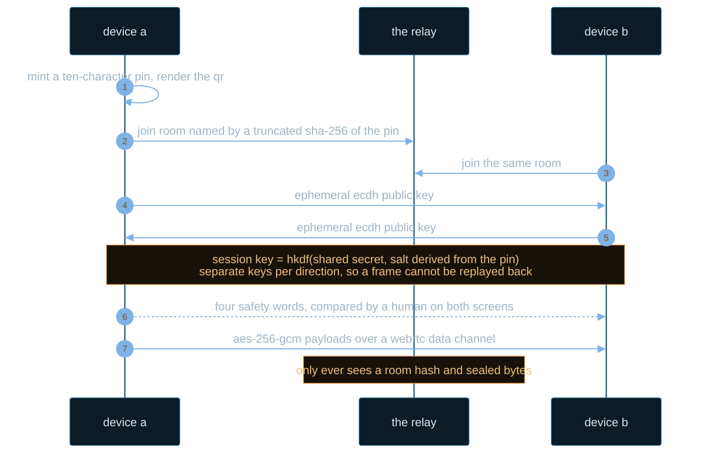
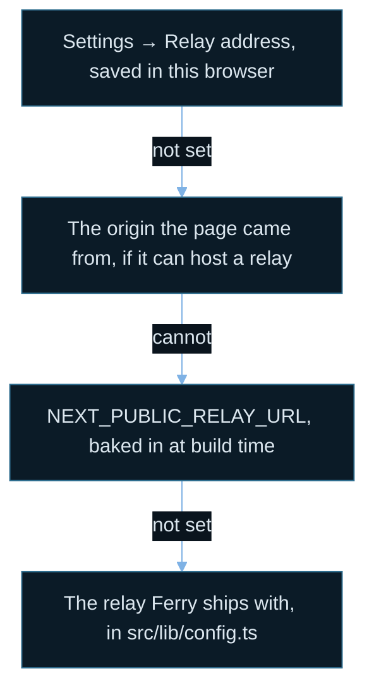

<div align="center">

<a href="https://ferry-share.github.io">
  
</a>

<br>

<a href="https://ferry-share.github.io"></a>
<a href="https://ferry-share.github.io/how-it-works/"></a>
<a href="https://github.com/Ferry-Share/Ferry-Share.github.io"></a>
<a href="https://github.com/Ferry-Share/Ferry-Share.github.io/commits/main/"></a>
<a href="https://github.com/Ferry-Share/Ferry-Share.github.io/blob/main/LICENSE"></a>


<br><br>

<a href="https://ferry-share.github.io"><b>Open Ferry</b></a> &nbsp;·&nbsp;
<a href="https://ferry-share.github.io/how-it-works/">How it works</a> &nbsp;·&nbsp;
<a href="https://ferry-share.github.io/about/">About</a> &nbsp;·&nbsp;
<a href="https://github.com/Ferry-Share/Ferry-Share.github.io">Source</a> &nbsp;·&nbsp;
<a href="https://github.com/Ferry-Share/Ferry-Share.github.io/issues">Issues</a>


</div>

## The problem, stated plainly

You want a password off your laptop and onto your phone. Every usual route goes through
somebody else: email it and it sits on a mail server, drop it in a chat and it lands in that
company's storage, upload it and now the link is the secret and the file is on a disk you do
not control.

Ferry opens a channel straight between the two browsers instead. It takes about ten seconds,
and when you close the tab there is nothing left to delete.

### Ten seconds, four steps

1. One device mints a ten-character code and shows it as a QR.
2. The other scans it, or you type the ten characters.
3. Both screens show four words. If they match, nobody is in the middle.
4. Send. Passwords, text, files up to 250 MB.

<div align="center">
  
</div>

<details>
<summary><b>The same handshake, as a diagram you can pan and zoom</b></summary>

<br>



Even the WebRTC offer, answer and ICE candidates are encrypted before they reach the relay,
so your local IP addresses are not exposed to it either.

</details>

## What it is built from

| Piece | What it is | Where it runs |
| --- | --- | --- |
| Front end | Next.js, exported to static files | GitHub Pages |
| Relay | about 200 lines of JavaScript over WebSockets | Cloudflare Workers, or any Node host |
| Transport | WebRTC data channel, relay as fallback | Between the two browsers |
| Crypto | WebCrypto: ECDH P-256, HKDF, AES-256-GCM | In the browser, nowhere else |

The relay exists because GitHub Pages serves static files and cannot hold a WebSocket open.
Two browsers that have never met need something to introduce them. That process is treated as
hostile by design: it never learns the pairing code, the keys, or the data, so hosting it
somewhere else costs nothing in privacy.

<div align="center">
  
</div>

## Run your own

<details>
<summary><b>Same network — one command, no hosting at all</b></summary>

<br>

```bash
npm install
npm run lan
```

One Node process serves the built front end and the relay together. It prints your LAN
address; open it on both devices and you are done. Nothing leaves your network.

Cameras need HTTPS, so QR scanning does not work over a plain `http://192.168.x.x` address.
On a LAN, type the ten-character code instead, or put the host behind HTTPS.

</details>

<details>
<summary><b>Over the internet — Pages plus a small relay</b></summary>

<br>

| Piece | Where it runs | What it costs |
| --- | --- | --- |
| Front end | GitHub Pages, via the included workflow | Free |
| Relay | Cloudflare Workers, or Render, Fly, your own box | Free tier is plenty |

**Cloudflare Workers** is the recommended relay: it does not sleep, so there is no half-minute
wait on the first pairing of the day. Add a `CLOUDFLARE_API_TOKEN` secret and run the deploy
workflow, or run `npx wrangler deploy` from your own machine. You end up with an address like
`wss://ferry-relay.<your-subdomain>.workers.dev/ws`.

**Anywhere that runs Node** works too. Only `ws` is a runtime dependency.

```bash
# Render    New → Blueprint → pick the repo; render.yaml does the rest
# Fly.io    fly launch --no-deploy && fly deploy
# Docker    docker build -t ferry-relay . && docker run -p 8081:8081 ferry-relay
# Your box  PORT=8081 node server/relay.js
```

</details>

<details>
<summary><b>Which relay a browser ends up talking to</b></summary>

<br>



Highest priority wins. The relay address is not a secret and the relay is not privileged: it
only ever sees a truncated hash of the PIN, and every payload is sealed with a key derived
from that PIN, which it never learns.

</details>

## The security model

The PIN is the only secret. Ten Crockford base-32 characters, about 50 bits, from
`crypto.getRandomValues`. It travels in a QR code or in the URL fragment, which browsers never
send to a server, and the app strips it out of the address bar on arrival.

Key agreement is bound to that PIN. Both sides derive the session key with HKDF salted from a
value derived from the PIN, so anyone who does not know it — including a malicious relay that
inserts its own peer — derives a different key, and their frames fail authentication instantly.
Keys are ephemeral, so capturing the traffic and learning the PIN later still does not decrypt
it.

Every property above is asserted in `test/`, against the real WebCrypto implementation rather
than a stand-in: both sides agree on a key and on the same four words, the two directions use
independent keys, a peer holding the wrong PIN is refused, a tampered frame fails its integrity
check, and no nonce ever repeats.

<details>
<summary><b>What Ferry deliberately does not protect against</b></summary>

<br>

- **Someone who gets the PIN first.** Anyone holding it before the second device joins can take
  that slot. Rooms hold two devices and no more, so if a stranger got in first, your own device
  is refused and you will notice. Treat the code like a door key.
- **A compromised device.** End-to-end encryption ends at the endpoints.
- **Traffic analysis by the relay.** It can see that two sockets exchanged *n* bytes, just not
  what they were.

</details>

<details>
<summary><b>Behaviour worth knowing</b></summary>

<br>

- Received items clear themselves: passwords after two minutes, text after five, files after
  fifteen. Each row offers *+2 min* and *Keep*.
- Copying a password offers a one-tap clipboard wipe afterwards.
- Files stream in 64 KB chunks with backpressure, so a 200 MB file does not blow up the tab.
  The cap on a single transfer is 250 MB.
- Paste anywhere to send a file. Ctrl or Cmd with Enter sends text. Drag and drop onto the file
  tab.
- Light and dark, keyboard focus rings throughout, and `prefers-reduced-motion` is respected.
- Chrome, Edge, Firefox and Safari, on desktop and mobile. QR scanning uses `BarcodeDetector`
  where available and falls back to `jsQR` elsewhere.

</details>

## Repositories

| Repository | What it holds |
| --- | --- |
| [Ferry-Share.github.io](https://github.com/Ferry-Share/Ferry-Share.github.io) | The app, the relay, the Cloudflare Worker and the tests. Next.js and TypeScript, MIT. |
| [.github](https://github.com/Ferry-Share/.github) | This profile, and the health files shared across the organisation. |

## Contributing

Issues and pull requests are welcome on the main repository. Node 22 or newer is needed: the
test suite imports the TypeScript sources directly and relies on the type stripping Node
enables by default from 22.18.

```bash
npm install
npm run dev          # front end at http://localhost:3000
npm run dev:relay    # relay at ws://localhost:8081/ws, second terminal
npm run lint
npm run typecheck
npm test             # needs a build first
```

Point the dev front end at the dev relay once, under **Settings → Relay address**.

Bug reports are most useful with the browsers on both ends, the network in between, and whether
the connection ribbon said direct or relayed.

<div align="center">


MIT licensed. Built in Sri Lanka.

<a href="https://ferry-share.github.io"><b>ferry-share.github.io</b></a>

</div>
